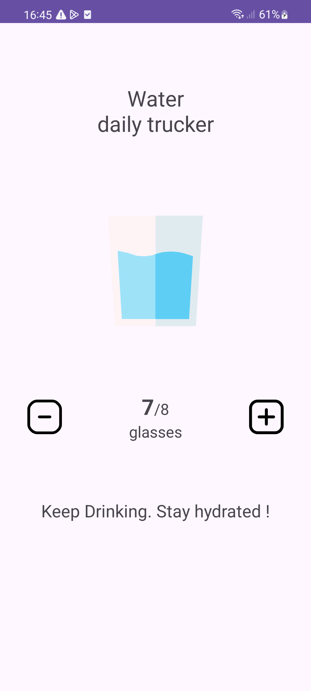
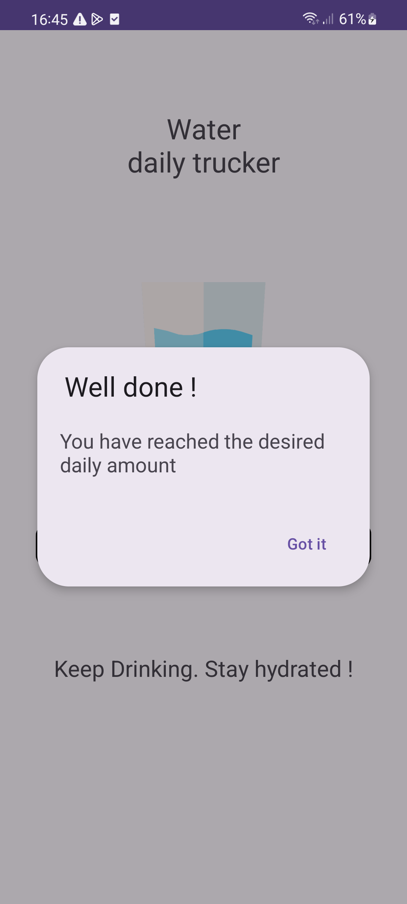
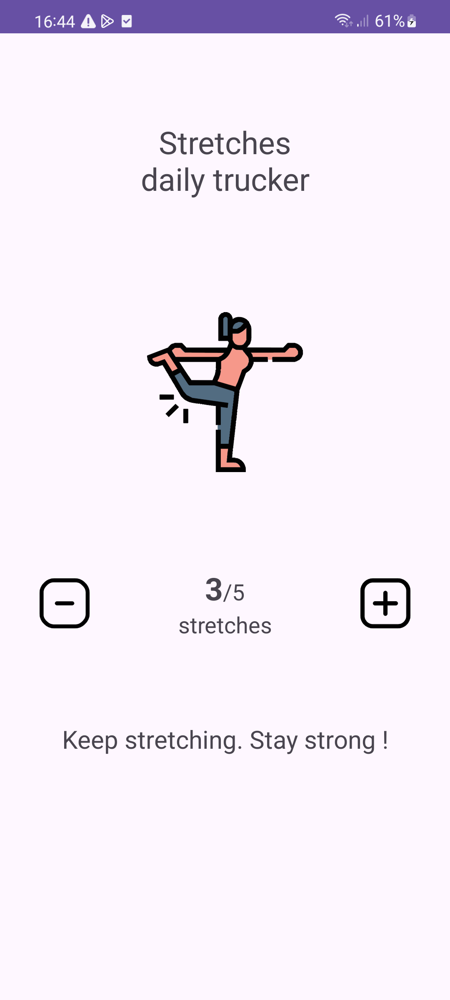

# Health Habits Tracker

This project encompasses two distinct applications, each focused on a specific health habit: water intake and stretching. To streamline development and maintain consistency, a shared common module is utilized. This module provides a foundational `Activity` class from which both apps derive their respective Activity implementations.

## App Descriptions

### Water Daily Tracker
Monitor and encourage daily water consumption.

<p align="center">
  

<p align="center">
  

### Stretches Daily Tracker
Track the amount of daily stretches.

<p align="center">
  

### Setup

1. Clone the repository:
   ```bash
   git clone https://github.com/TalBar4444/Multi-Counting-App.git
   cd Multi-Counting-App

2. Open the project in Android Studio.
3. Build and run the desired module (water-tracker or stretches-tracker).

### 📄 License
MIT License

Copyright (c) 2025 Tal Bar.

Permission is hereby granted, free of charge, to any person obtaining a copy
of this software and associated documentation files (the "Software"), to deal
in the Software without restriction, including without limitation the rights to
use, copy, modify, merge, publish, distribute, sublicense, and/or sell copies
of the Software, and to permit persons to whom the Software is furnished to do
so, subject to the following conditions:

The above copyright notice and this permission notice shall be included in all
copies or substantial portions of the Software.

THE SOFTWARE IS PROVIDED "AS IS", WITHOUT WARRANTY OF ANY KIND, EXPRESS OR
IMPLIED, INCLUDING BUT NOT LIMITED TO THE WARRANTIES OF MERCHANTABILITY,
FITNESS FOR A PARTICULAR PURPOSE AND NONINFRINGEMENT. IN NO EVENT SHALL THE
AUTHORS OR COPYRIGHT HOLDERS BE LIABLE FOR ANY CLAIM, DAMAGES OR OTHER
LIABILITY, WHETHER IN AN ACTION OF CONTRACT, TORT OR OTHERWISE, ARISING FROM,
OUT OF OR IN CONNECTION WITH THE SOFTWARE OR THE USE OR OTHER DEALINGS IN THE
SOFTWARE.

### Credits
Icon made by Flat Icons (www.flat-icons.com) from www.flaticon.com

